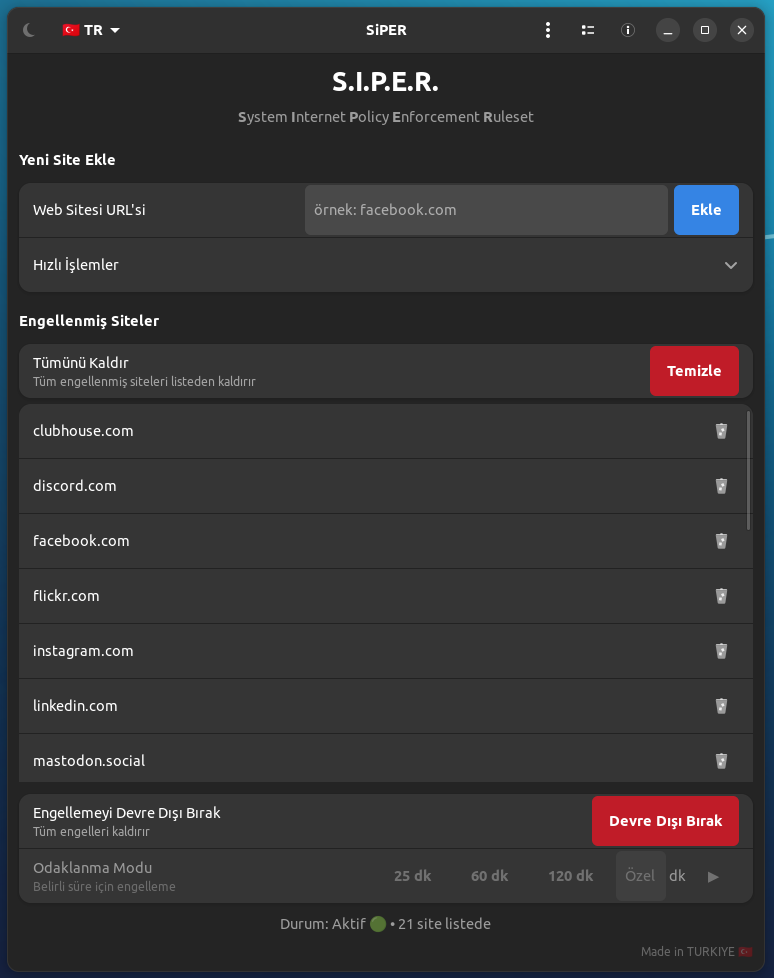
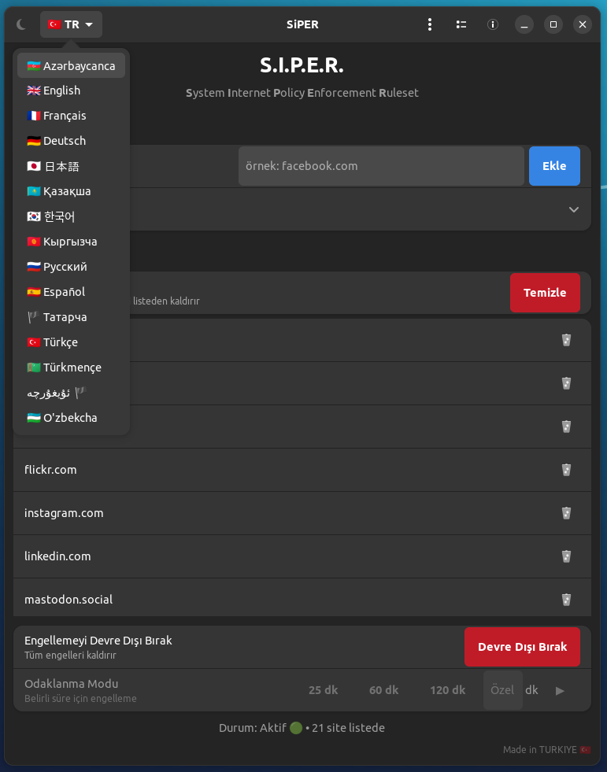
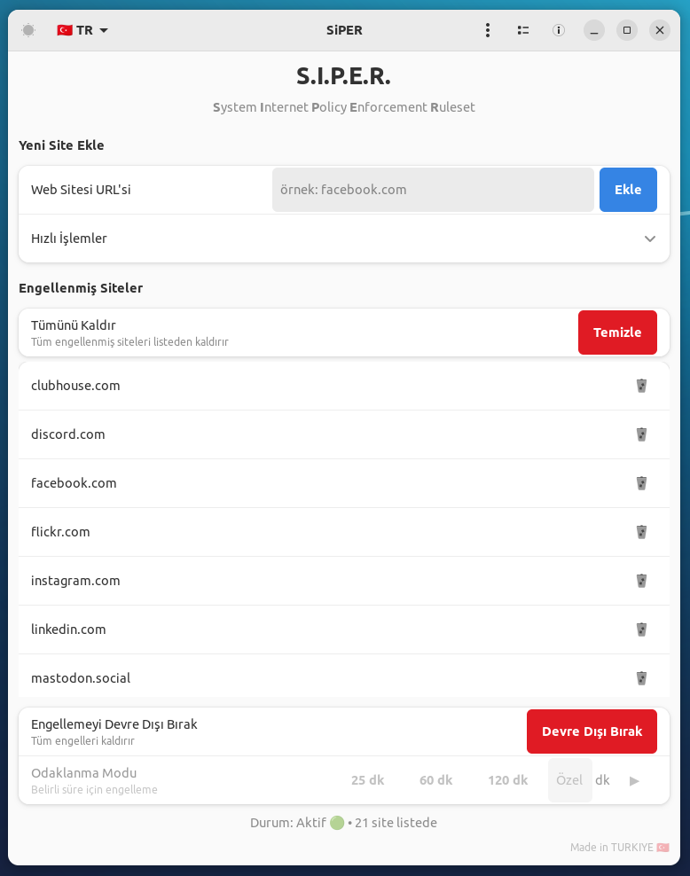

<a href="#">
    
</a>

## [English Guide](https://github.com/cektor/S.I.P.E.R.//blob/main/README.md)

# S.I.P.E.R.

**Sistem İnternet Politikası Uygulama Kuralları**

[](https://www.gnu.org/licenses/gpl-3.0)
[](https://www.python.org/downloads/)
[](https://gtk.org/)

Modern GTK 4 ve Libadwaita ile geliştirilmiş güçlü, kullanıcı dostu web sitesi engelleme ve verimlilik uygulaması. S.I.P.E.R., Pomodoro odaklanma modu, kapsamlı istatistikler ve çoklu dil desteği gibi gelişmiş özelliklerle dikkat dağıtan web sitelerini engelleyerek odaklanmanızı ve verimliliğinizi korumanıza yardımcı olur.


## ✨ Özellikler

### 🛡️ **Gelişmiş Web Sitesi Engelleme**
- **Güvenli hosts dosyası yönetimi** otomatik yedekleme ve geri yükleme ile
- **Gerçek zamanlı engelleme** tarayıcı eklentileri veya ek yazılım olmadan
- **Toplu kategori engelleme** 12 önceden tanımlanmış kategori ile
- **Özel site ekleme** akıllı URL ayrıştırma ile
- **İçe/Dışa aktarma işlevi** engel listelerini paylaşmak için

### 🍅 **Pomodoro Odaklanma Modu**
- **Zamanlı engelleme oturumları** (25, 60, 120 dakika veya özel süre)
- **Otomatik geri yükleme** odaklanma süresi bittiğinde
- **Odaklanma istatistikleri takibi** detaylı oturum geçmişi ile
- **Motivasyonel bildirimler** sizi yolda tutmak için

### 📊 **Kapsamlı İstatistikler**
- **Toplam odaklanma süresi** tüm oturumlarda takip
- **Haftalık istatistikler** ilerlemenizi izlemek için
- **Oturum sayısı** ve süre analizi
- **Geçmiş veriler** kalıcı depolama ile

### 🌍 **Çoklu Dil Desteği**
- **15 dil** Türkçe, İngilizce, Rusça, Almanca, Fransızca, İspanyolca, Japonca, Korece ve Türk dilleri dahil
- **Dinamik dil değiştirme** yeniden başlatma olmadan
- **Yerelleştirilmiş arayüz** gerektiğinde uygun RTL desteği ile
- **Kültürel uyarlama** uygun bayraklar ve bölgesel içerik ile

### 🎨 **Modern Kullanıcı Arayüzü**
- **GTK 4 + Libadwaita** yerel GNOME entegrasyonu için
- **Uyarlanabilir tasarım** farklı ekran boyutlarında çalışır
- **Koyu/Açık/Otomatik tema** sistem entegrasyonu ile destek
- **Yumuşak animasyonlar** ve modern görsel geri bildirim
- **Toast bildirimleri** kullanıcı geri bildirimi için

### 🔐 **Güvenlik ve Gizlilik**
- **PolicyKit entegrasyonu** güvenli yetki yönetimi için
- **Ağ bağımlılığı yok** - tamamen çevrimdışı çalışır
- **Yerel veri depolama** bulut senkronizasyonu yok
- **Şeffaf işlemler** detaylı hata ayıklama günlüğü ile
- **Güvenli yedekleme sistemi** veri kaybını önlemek için

## 📸 Ekran Görüntüleri

<div align="left">











## 🚀 Yükleme & Hızlı Başlangıç

# Linux'a doğrudan yüklemek için


Linux (debian tabanlı) Terminal: Linux (debian tabanlı dağıtımlar) Terminal'den doğrudan yüklemek için.
```bash
wget -O Setup_Linux64.deb https://github.com/cektor/S.I.P.E.R./releases/download/1.0.0/Setup_Linux64.deb && sudo apt install ./Setup_Linux64.deb && sudo apt-get install -f -y
```


### Ön Koşullar

- **Linux** (Ubuntu 20.04+, Fedora 35+, Arch Linux veya herhangi bir modern dağıtım)
- **Python 3.8+**
- **GTK 4.0+**
- **Libadwaita 1.0+**
- **PolicyKit** (genellikle önceden yüklü)

### Kurulum

#### Seçenek 1: Kaynaktan (Önerilen)

```bash
# Depoyu klonlayın
git clone https://github.com/cektor/S.I.P.E.R.git
cd S.I.P.E.R.

# Python bağımlılıklarını yükleyin
pip install -r requirements.txt

# Sistem bağımlılıklarını yükleyin (Ubuntu/Debian)
sudo apt update
sudo apt install python3-gi python3-gi-cairo gir1.2-gtk-4.0 gir1.2-adw-1 polkit-1

# Sistem bağımlılıklarını yükleyin (Fedora)
sudo dnf install python3-gobject gtk4-devel libadwaita-devel polkit

# Sistem bağımlılıklarını yükleyin (Arch Linux)
sudo pacman -S python-gobject gtk4 libadwaita polkit

# Uygulamayı çalıştırın
python3 siper.py
```

#### Seçenek 2: Sistem Kurulumu

```bash
# Uygulama dosyalarını kopyalayın
sudo cp siper.py /usr/local/bin/siper
sudo chmod +x /usr/local/bin/siper

# Dil dosyalarını kopyalayın
sudo mkdir -p /usr/share/siper/languages/
sudo cp -r languages/* /usr/share/siper/languages/

# İkonu kopyalayın
sudo cp siperlo.png /usr/share/pixmaps/

# Masaüstü girişi oluşturun
cat > ~/.local/share/applications/siper.desktop << EOF
[Desktop Entry]
Name=S.I.P.E.R.
Comment=Sistem İnternet Politikası Uygulama Kuralları
Exec=/usr/local/bin/siper
Icon=siperlo
Terminal=false
Type=Application
Categories=Utility;Network;
Keywords=website;blocker;productivity;focus;
EOF

# Masaüstü veritabanını güncelleyin
update-desktop-database ~/.local/share/applications/
```

### İlk Çalıştırma

1. **S.I.P.E.R.'i başlatın** uygulama menünüzden veya `python3 siper.py` komutunu çalıştırın
2. **Web sitelerini ekleyin** URL giriş alanını kullanarak engellemek için
3. **Hızlı kategorileri seçin** genişletilebilir menüden (Sosyal, Video, Oyun, vb.)
4. **Engellemeyi etkinleştirin** geçiş düğmesini kullanarak
5. **Odaklanma modunu başlatın** zamanlı verimlilik oturumları için

## 📖 Kullanım Kılavuzu

### Temel Web Sitesi Engelleme

1. **Bireysel Siteleri Ekleyin:**
   - Giriş alanına bir web sitesi URL'si girin (örn. `facebook.com`)
   - "Ekle"ye tıklayın veya Enter'a basın
   - Site engel listenize eklenecektir

2. **Hızlı Kategorileri Kullanın:**
   - Kategori menüsünü genişletmek için "Hızlı İşlemler"e tıklayın
   - 12 önceden tanımlanmış kategoriden seçin:
     - 📱 **Sosyal Medya**: Facebook, Twitter, Instagram, TikTok, vb.
     - 🎥 **Video**: YouTube, Netflix, Twitch, vb.
     - 📰 **Haber**: CNN, BBC, yerel haber siteleri
     - 🎮 **Oyun**: Steam, Epic Games, oyun platformları
     - 🛍️ **Alışveriş**: Amazon, eBay, e-ticaret siteleri
     - 🔞 **Yetişkin**: Yetişkin içerik web siteleri
     - ₿ **Kripto**: Kripto para borsaları ve ticaret platformları
     - 🌍 **Torrent**: BitTorrent ve dosya paylaşım siteleri
     - 📚 **Eğitim**: Çevrimiçi öğrenme platformları
     - 💼 **İş**: Profesyonel ağ ve iş siteleri
     - 🎵 **Müzik**: Yayın ve müzik platformları
     - 🏃 **Spor**: Spor haberleri ve yayın siteleri

3. **Engellemeyi Etkinleştir/Devre Dışı Bırak:**
   - Tüm engelleri etkinleştirmek veya devre dışı bırakmak için ana geçiş düğmesini kullanın
   - Etkinleştirildiğinde, listenizdeki tüm siteler sistem genelinde engellenecektir
   - Devre dışı bırakıldığında, tüm siteler tekrar erişilebilir hale gelir

### Odaklanma Modu (Pomodoro Tekniği)

1. **Hızlı Odaklanma Oturumları:**
   - Önceden ayarlanmış süreler için 25dk, 60dk veya 120dk düğmelerine tıklayın
   - Engelleme seçilen süre için otomatik olarak etkinleşecektir
   - Oturum bittiğinde bir bildirim görünecektir

2. **Özel Odaklanma Oturumları:**
   - Metin alanına dakika cinsinden özel bir süre girin
   - Başlatmak için oynat düğmesine (▶) tıklayın
   - Kişiselleştirilmiş verimlilik programları için mükemmel

3. **Odaklanma İstatistikleri:**
   - İlerlemenizi görmek için istatistik düğmesine (📊) tıklayın
   - Toplam odaklanma süresi, haftalık istatistikler ve oturum sayısını görün
   - Zaman içindeki verimlilik gelişimlerinizi takip edin

### Gelişmiş Özellikler

#### Engel Listelerini İçe/Dışa Aktarma

- **Dışa Aktarma:** Menü → Dışa Aktar → Engel listenizi JSON olarak kaydedin
- **İçe Aktarma:** Menü → İçe Aktar → Önceden kaydedilmiş bir engel listesi yükleyin
- Cihazlar arasında veya takım üyeleriyle konfigürasyonları paylaşın

#### Çoklu Dil Desteği

- Başlıktaki dil düğmesine (🇹🇷 TR) tıklayın
- 15 mevcut dilden birini seçin
- Arayüz yeni dille yeniden başlayacaktır

#### Tema Özelleştirme

- Tema düğmesine (☀️/🌙/⚙️) tıklayarak şunlar arasında geçiş yapın:
  - **Açık Tema**: Parlak, temiz arayüz
  - **Koyu Tema**: Düşük ışık ortamları için gözleri yormayan
  - **Otomatik Tema**: Sistem tercihinizi takip eder

#### İstatistikler ve Analitik

- **Toplam Süre**: Tüm oturumlardaki kümülatif odaklanma süresi
- **Bu Hafta**: Mevcut hafta için odaklanma süresi
- **Oturum Sayısı**: Tamamlanan odaklanma oturumu sayısı
- **Geçmiş Veriler**: Verimlilik yolculuğunuzun kalıcı takibi

## 🔧 Konfigürasyon

### Konfigürasyon Dosyaları

S.I.P.E.R. konfigürasyonunu `~/.config/siper/` dizininde saklar:

```
~/.config/siper/
├── config.json          # Ana konfigürasyon
├── stats.json           # Odaklanma istatistikleri
├── debug.log           # Hata ayıklama bilgileri
├── hosts_backup        # Orijinal hosts dosyasının yedeği
└── languages/          # Dil dosyaları (ilk çalıştırmada kopyalanır)
    ├── english.ini
    ├── turkish.ini
    └── ...
```

### Konfigürasyon Seçenekleri

`config.json` dosyası şunları içerir:

```json
{
  "blocked_sites": ["facebook.com", "youtube.com"],
  "is_active": false,
  "theme_mode": "auto",
  "language": "turkish"
}
```

### Özel Dil Dosyaları

`languages/` dizininden mevcut bir `.ini` dosyasını kopyalayarak ve değerleri çevirerek özel dil dosyaları oluşturabilirsiniz. Dosya yapısı standart INI formatını takip eder:

```ini
[GENERAL]
app_name = S.I.P.E.R.
app_subtitle = Sistem İnternet Politikası Uygulama Kuralları

[WINDOW]
title = S.I.P.E.R.
add_site_group = Yeni Site Ekle
# ... daha fazla çeviri
```

## 🛠️ Teknik Detaylar

### Mimari

S.I.P.E.R. modern, modüler bir mimari ile geliştirilmiştir:

- **Ön Yüz**: Yerel Linux entegrasyonu için GTK 4 + Libadwaita
- **Arka Yüz**: Engelleyici olmayan işlemler için threading ile Python 3
- **Güvenlik**: Güvenli yetki yükseltme için PolicyKit (pkexec)
- **Depolama**: Atomik yazımlar ile JSON tabanlı konfigürasyon
- **Günlükleme**: Dosya ve konsol çıktısı ile kapsamlı hata ayıklama sistemi

### Nasıl Çalışır

1. **Hosts Dosyası Yönetimi**: S.I.P.E.R. engellenmiş web sitelerini `127.0.0.1` (localhost) adresine yönlendirmek için sistemin `/etc/hosts` dosyasını değiştirir
2. **Güvenli İşlemler**: Tüm sistem seviyesi değişiklikler PolicyKit aracılığıyla kullanıcı kimlik doğrulaması gerektirir
3. **Yedekleme Sistemi**: Orijinal hosts dosyası herhangi bir değişiklikten önce otomatik olarak yedeklenir
4. **Gerçek Zamanlı Güncellemeler**: Değişiklikler tarayıcı yeniden başlatması gerektirmeden hemen etkili olur

### Güvenlik Değerlendirmeleri

- **Yetki Yükseltme**: Yalnızca kullanıcı eylemleri tarafından açıkça istendiğinde gerçekleşir
- **Yedekleme Güvenliği**: Orijinal hosts dosyası her zaman korunur
- **Atomik İşlemler**: Dosya değişiklikleri bozulmayı önlemek için atomiktir
- **Kullanıcı Kontrolü**: Tüm işlemler kullanıcı tarafından geri alınabilir

### Performans

- **Hafif**: Verimli GTK 4 render ile minimal kaynak kullanımı
- **Hızlı Başlangıç**: Optimize edilmiş başlatma ve konfigürasyon yükleme
- **Duyarlı UI**: Uygun threading ile engelleyici olmayan işlemler
- **Bellek Verimli**: Çöp toplama ile akıllı bellek yönetimi

## 🐛 Sorun Giderme

### Yaygın Sorunlar

#### "İzin Reddedildi" Hataları
```bash
# PolicyKit'in yüklü ve çalışır durumda olduğundan emin olun
sudo systemctl status polkit

# pkexec'in mevcut olup olmadığını kontrol edin
which pkexec
```

#### GTK/Libadwaita Bulunamadı
```bash
# Ubuntu/Debian
sudo apt install python3-gi python3-gi-cairo gir1.2-gtk-4.0 gir1.2-adw-1

# Fedora
sudo dnf install python3-gobject gtk4-devel libadwaita-devel

# Arch Linux
sudo pacman -S python-gobject gtk4 libadwaita
```

#### Uygulama Başlamıyor
```bash
# Python sürümünü kontrol edin (3.8+ gerekli)
python3 --version

# Bağımlılıkları yükleyin
pip install -r requirements.txt

# Hata ayıklama çıktısı ile çalıştırın
python3 siper.py --debug
```

#### Hosts Dosyası Sorunları
```bash
# Hosts dosyası izinlerini kontrol edin
ls -la /etc/hosts

# Gerekirse hosts dosyasını manuel olarak geri yükleyin
sudo cp ~/.config/siper/hosts_backup /etc/hosts
```

### Hata Ayıklama Modu

Sorun giderme için S.I.P.E.R.'i hata ayıklama çıktısı ile çalıştırın:

```bash
python3 siper.py --debug
```

Bu, hem terminalde hem de `~/.config/siper/debug.log` dosyasında detaylı günlük bilgileri sağlayacaktır.

### Yardım Alma

- **Günlükleri kontrol edin**: `~/.config/siper/debug.log` detaylı işlem bilgileri içerir
- **GitHub Sorunları**: [https://github.com/cektor/S.I.P.E.R./issues](https://github.com/cektor/S.I.P.E.R./issues) adresinde hata bildirin
- **Tartışmalar**: GitHub'da topluluk tartışmalarına katılın

## 🤝 Katkıda Bulunma

Topluluktan gelen katkıları memnuniyetle karşılıyoruz! İşte nasıl yardımcı olabileceğiniz:

### Geliştirme Kurulumu

```bash
# Depoyu fork edin ve klonlayın
git clone https://github.com/kullaniciadi/S.I.P.E.R.git
cd S.I.P.E.R.

# Sanal ortam oluşturun
python3 -m venv venv
source venv/bin/activate

# Geliştirme bağımlılıklarını yükleyin
pip install -r requirements.txt

# Pre-commit hook'larını yükleyin (isteğe bağlı)
pip install pre-commit
pre-commit install
```

### Katkıda Bulunma Yolları

1. **🐛 Hata Raporları**: Detaylı yeniden üretme adımları ile sorunları bildirin
2. **💡 Özellik İstekleri**: Yeni özellikler veya iyileştirmeler önerin
3. **🌍 Çeviriler**: Yeni diller için destek ekleyin
4. **📝 Dokümantasyon**: Dokümantasyon ve örnekleri geliştirin
5. **💻 Kod**: Hata düzeltmeleri veya yeni özellikler için pull request gönderin
6. **🎨 Tasarım**: UI/UX iyileştirilerine katkıda bulunun
7. **🧪 Test**: Yeni özellikleri test etmeye yardımcı olun ve geri bildirim verin

### Çeviri Kılavuzları

Yeni bir dil eklemek için:

1. `languages/english.ini` dosyasını `languages/diliniz.ini` olarak kopyalayın
2. Tüm değerleri çevirin (anahtarları değiştirmeden bırakın)
3. Uygun bayrak emoji ve dil kodu ekleyin
4. Çeviriyi uygulamada test edin
5. Bir pull request gönderin

### Kod Stili

- Python kodu için PEP 8'i takip edin
- Anlamlı değişken ve fonksiyon isimleri kullanın
- Genel fonksiyonlar için docstring ekleyin
- Uygun yerlerde tip ipuçları dahil edin
- Yeni özellikler için birim testleri yazın

## 📄 Lisans

S.I.P.E.R. **GNU Genel Kamu Lisansı v3.0** altında lisanslanmıştır.

```
S.I.P.E.R. - Sistem İnternet Politikası Uygulama Kuralları
Telif Hakkı (C) 2025 ALG Yazılım A.Ş.

Bu program özgür yazılımdır: Free Software Foundation tarafından
yayınlanan GNU Genel Kamu Lisansı'nın 3. sürümü veya (tercihinize
bağlı olarak) daha sonraki bir sürümü altında yeniden dağıtabilir
ve/veya değiştirebilirsiniz.

Bu program faydalı olacağı umuduyla dağıtılmaktadır, ancak
HİÇBİR GARANTİ YOKTUR; hatta SATILABİLİRLİK veya BELİRLİ BİR
AMACA UYGUNLUK için zımni garanti bile yoktur. Daha fazla ayrıntı
için GNU Genel Kamu Lisansı'na bakın.

Bu programla birlikte GNU Genel Kamu Lisansı'nın bir kopyasını
almış olmalısınız. Almadıysanız, <https://www.gnu.org/licenses/>
adresine bakın.
```

## 👨💻 Yazar ve Krediler

### Baş Geliştirici
**Fatih ÖNDER (CekToR)** 🇹🇷
- GitHub: [@cektor](https://github.com/cektor)
- Şirket: ALG Yazılım A.Ş.

### Kullanılan Teknolojiler
- **GTK 4**: Modern kullanıcı arayüzü çerçevesi
- **Libadwaita**: GNOME tasarım dili ve bileşenleri
- **Python 3**: Ana programlama dili
- **PolicyKit**: Güvenli yetki yönetim sistemi

### Teşekkürler
- GTK 4 ve Libadwaita için GNOME Projesi
- Python Yazılım Vakfı
- İlham ve geri bildirim için açık kaynak topluluğu
- Tüm katkıda bulunanlar ve çevirmenler

## 🔗 Bağlantılar

- **Ana Sayfa**: [https://github.com/cektor/S.I.P.E.R.](https://github.com/cektor/S.I.P.E.R.)
- **Sorunlar**: [https://github.com/cektor/S.I.P.E.R./issues](https://github.com/cektor/S.I.P.E.R./issues)
- **Sürümler**: [https://github.com/cektor/S.I.P.E.R./releases](https://github.com/cektor/S.I.P.E.R./releases)
- **Lisans**: [https://www.gnu.org/licenses/gpl-3.0.html](https://www.gnu.org/licenses/gpl-3.0.html)

---

**Türkiye'de ❤️ ile yapıldı 🇹🇷**

*S.I.P.E.R. - Dijital yaşamınızın kontrolünü ele alın, bir seferde bir engellenmiş site.*
